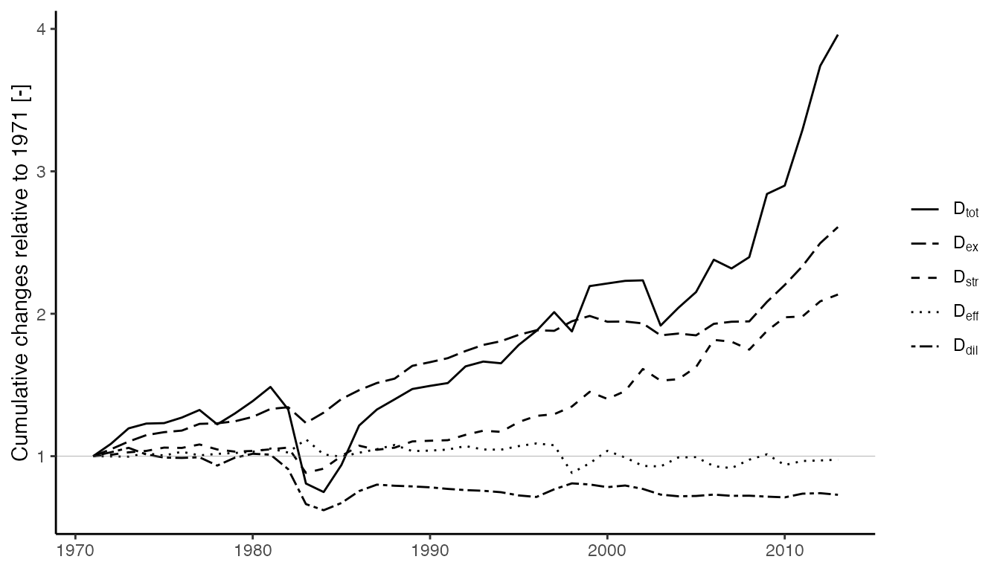

Max length: 250--1000 words

<!-- Define some macros to use later -->
[link-cran]:           https://cran.r-project.org
[link-ieatools]:       https://github.com/MatthewHeun/IEATools
[link-ieaweeb]:        https://www.iea.org/data-and-statistics/data-product/world-energy-balances
[link-matsbyname]:     https://github.com/MatthewHeun/matsbyname
[link-matsindf]:       https://github.com/MatthewHeun/matsindf
[link-mwtools]:        https://github.com/EnergyEconomyDecoupling/MWTools
[link-pfudatabase]:    https://github.com/energyeconomydecoupling/PFUDatabase
[link-pfuaggdatabase]: https://github.com/EnergyEconomyDecoupling/PFUAggDatabase
[link-rclabels]:       https://github.com/MatthewHeun/RCLabels
[link-recca]:          https://github.com/MatthewHeun/Recca
[link-targets]:        https://docs.ropensci.org/targets
[link-tidyverse]:      https://www.tidyverse.org


# Summary

Energy flowing through societal energy conversion chains (ECCs)
enables economic activity and facilitates human flourishing.
To understand economic growth and human well-being, 
the field of societal energy analysis evaluates ECCs
from the primary stage 
(resources extracted from the environment, 
such as coal, oil, and natural gas) 
to the final stage
(energy purchased by consumers, 
such as refined petroleum and electricity),
to the useful stage
(energy desired by the end user, 
such as heat, motion, and light),
and sometimes to energy services
(such as thermal comfort, transport, and illumination).
Societal exergy analysis (SEA), 
an extension of energy analysis,
quantifies ECCs in exergy terms^[Exergy is 
the mechanical work potential of energy.].

We created a suite of `R` packages 
(some of which are generally useful and available through 
[CRAN][link-cran],
others of which are focused on SEA and available on GitHub)
to assist SEA practitioners as they analyze 
energy movement through society. 
The new packages enable analysis of any country in the world
across timespans of decades or longer.
In short, the packages enable, for the first time, scalable SEA.
We used the new packages to create the "PFU Database," 
a new resource for the SEA community^[Strictly speaking, 
we create data frames of matrices, 
not an SQL or similar database.]. 

This paper describes the design of the new packages and
demonstrates briefly their use.


# Statement of need

Historically, societal exergy analysts have
analyzed the ECCs of individual countries
using a large number of linked spreadsheets,
often starting with primary- and final-stage data 
from the [IEA][link-ieaweeb]'s
world energy balances
[@Ayres:2003ec; @Serrenho:2014aa; @Brockway:2014aa; @Brockway:2015aa]. 
Data were stored in varying and inconsistent formats.
A different attempt to create an SEA database
estimated technical energy efficiencies 
of end-use machines by economic status in a country,
thereby precluding the use of the database for energy-economy studies [@De-Stercke:2014].

The authors of the current paper and others in the field
wanted to expand SEA to cover all countries, but
the spreadsheet approach to SEA was
deemed not scalable.
A new approach to SEA was needed, 
one that scaled across all countries 
for many years without relying on economic data
to estimate technical efficiencies. 


# Design of `R` packages

The most important decision for the suite of SEA packages
involves data format.
We authors are among those who
developed the Physical Supply-Use Table (PSUT) framework,
a matrix approach to describing energy flows from 
resource extraction to
processing stages and, ultimately, 
to final demand [@Rocco:2016; @Guevara:2017; @Heun:2018].
The PSUT framework succinctly describes the flow of energy carriers
("products" in PSUT terminology) 
among energy conversion machines 
("industries" in PSUT terminology)
with a set of six matrices described in the following table.

| Matrix      | rows x columns     | Name                           | Description                                              |
|:------------|:-------------------|:-------------------------------|:---------------------------------------------------------|
| **R**       | industry x product | Resource matrix                | Contains exogeneous energy inputs to an ECC              |
| **U**       | product x industry | Use matrix                     | Describes how each energy conversion device uses energy; the sum of **U_feed** and **U_EIOU** |
| **U_feed**  | product x industry | Feedstock use matrix           | Describes feedstock inputs to energy conversion devices  |
| **U_EIOU**  | product x industry | Energy industry own use matrix | Describes how the energy industry uses energy            |
| **V**       | industry x product | Make matrix                    | Describes how each energy conversion device makes energy |
| **Y**       | product x industry | Final demand matrix            | Describes how each energy carrier is consumed            |

Further development followed from selection of the PSUT framework.
First, the matrices of the PSUT framework carry the challenge that 
different countries and years 
have varying energy carriers (products) and
varying energy conversion machines (industries),
meaning that PSUT matrices for different countries and years 
have differing sizes and differing row and column names.
To get around this challenge, we created the
[matsbyname][link-matsbyname] [@Heun-matsbyname:2023]
package which enables matrix mathematics 
that respects matrix row and column names, 
inserting rows or columns of `0`s when needed.
Second,
we knew it would be convenient to perform _matrix_ mathematics 
as easily as _scalar_ mathematics
in `R` data frames
using the [tidyverse][link-tidyverse] syntax [@Wickham:2019]. 
We developed the [matsindf][link-matsindf] package [@Heun-matsindf:2023]
to enable this functionality.
Finally, manipulating row and column names proved to be a challenge, 
especially for matrices in PSUT data frames, so 
we developed the [RCLabels][link-rclabels] package [@Heun-RCLabels:2023]
for that purpose.
The table below summarizes these packages, 
all of which are generally useful and available on 
[CRAN][link-cran].

| Package | Function |
|:--------|:---------|
| [RCLabels][link-rclabels]     | Manipulates row and column names in [matsindf][link-matsindf] data frames |
| [matsbyname][link-matsbyname] | Performs matrix mathematics that respects row and column names |
| [matsindf][link-matsindf]     | Stores matrices in cells of a data frame, thereby enabling [tidyverse][link-tidyverse] syntax |


Several calculation steps are required to create the PFU database. 
Each step is assisted by an `R` package that we created.
First, the IEA's primary- and final-stage WEEB data must be converted
to the PSUT format, 
a task completed by the [IEATools][link-ieatools] package [@Heun-IEATools:2023]. 
Second, human and animal muscle work must be calculated from 
labor and FAO data following the methodology of @Steenwyk:2022ww
using the [MWTools][link-mwtools] package [@Marshall:2023ab]. 
Third, the IEA's primary- and final-stage ECC data 
are extended to the useful stage by
(a) allocating final stage energy to end-use machines and
(b) multiplying allocated final energy by the 
final-to-useful efficiency of each machine.
This task is accomplished by the
[Recca][link-recca] [@Heun-Recca:2023]
and 
[PFUDatabase](https://github.com/energyeconomydecoupling/PFUDatabase/) [@Heun-PFUDatabase:2023]
packages.
The pipeline is modular, such that data for an country can be added at a later date
to improve the database. 
Finally, ECCs must be converted from energy terms to exergy terms. 
This step is assisted by the [Recca][link-recca] package.
The steps to create the PSUT matrices for each country and each year
are accomplished by a
[targets][link-targets] [@Landau:2021aa]
computation pipeline
available in the [PFUDatabase][link-pfudatabase]
package.
A unique feature of the
[PFUDatabase][link-pfudatabase]
pipeline is an exemplar system that allows
analyses to proceed when allocation or efficiency data for a country are unavailable.

A second [targets][link-targets] pipeline 
in the [PFUAggDatabase][link-pfuaggdatabase] package [@Heun-PFUAggDatabase:2023]
aggregates ECCs
by region 
(continents and world),
by product category 
(e.g., Coal and coal products, 
Low-, Medium-, and High-temperature heat, etc.), 
by end use sectors
(e.g., Residential, Transport, etc.), and
to primary, final, and useful (PFU) stages.
Furthermore, 
[PFUAggDatabase][link-pfuaggdatabase]
calculates aggregated efficiencies across 
the primary, final, and useful stages of all ECCs in the database.
The [Recca][link-recca] package is used extensively by the
[PFUAggDatabase][link-pfuaggdatabase]
pipeline.

The packages in the following table are specific to creating the PFU database 
and are available on GitHub.

| Package | Function |
|:--------|:---------|
| [IEATools][link-idatools]             | Converts IEA data to [matsindf][link-matsindf] format |
| [MWTools][link-mwtools]               | Converts ILO and FAO data to human and animal muscle work information in [matsindf][link-matsindf] format |
| [Recca][link-recca]                   | Performs `R` energy conversion chain analysis |
| [PFUDatabase][link-pfudatabase]       | A [targets][link-targets] pipeline to create a data frame of PSUT matrices |
| [PFUAggDatabase][link-pfuaggdatabase] | A [targets][link-targets] pipeline to aggregate PSUT matrices |

Input data for the PFU Database can be found in @Marshall:2023aa.
Access to the PFU Database can be obtained by correspondence 
with author [PEB](mailto:P.E.Brockway@leeds.ac.uk) data^[Access to the PFU Database
is restricted to those who have access to the [IEA WEEB data][link-ieaweeb].].


# Example


```r
library(Recca)
```


# Conclusion

The new `R` packages 


enables 


# Acknowledgements


# Mathematics

Single dollars ($) are required for inline mathematics e.g. $f(x) = e^{\pi/x}$

Double dollars make self-standing equations:

$$\Theta(x) = \left\{\begin{array}{l}
0\textrm{ if } x < 0\cr
1\textrm{ else}
\end{array}\right.$$

You can also use plain \LaTeX for equations
\begin{equation}\label{eq:fourier}
\hat{f}(\omega) = \int_{-\infty}^{\infty} f(x) e^{i\omega x} dx
\end{equation}
and refer to \autoref{eq:fourier} from text.

# Citations

Citations to entries in paper.bib should be in
[rMarkdown](http://rmarkdown.rstudio.com/authoring_bibliographies_and_citations.html)
format.

If you want to cite a software repository URL (e.g. something on GitHub without a preferred
citation) then you can do it with the example BibTeX entry below for @fidgit.

For a quick reference, the following citation commands can be used:
- `@author:2001`  ->  "Author et al. (2001)"
- `[@author:2001]` -> "(Author et al., 2001)"
- `[@author1:2001; @author2:2001]` -> "(Author1 et al., 2001; Author2 et al., 2002)"

# Figures

Figures can be included like this:


and referenced from text using \autoref{fig:example}.

Figure sizes can be customized by adding an optional second parameter:

{ width=20% }

# Acknowledgements

We acknowledge contributions from Brigitta Sipocz, Syrtis Major, and Semyeong
Oh, and support from Kathryn Johnston during the genesis of this project.

# References
